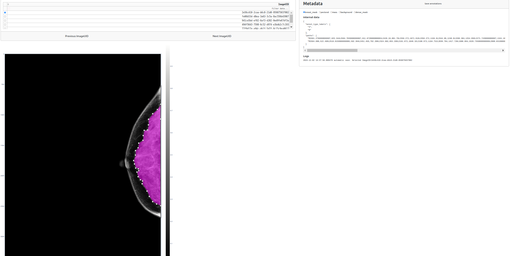

# Annotation tool 




### Usage 

```
usage: main.py [-h] --h5_dir H5_DIR [-f OUTPUT_FILE]

options:
  -h, --help            show this help message and exit
  --h5_dir H5_DIR
  -f OUTPUT_FILE, --file OUTPUT_FILE

```

### Test the Annotation tool on `test_data/` folder

```shell
cd deepjoint-algo/

bash docker/run_in_docker.sh -i deepjoint_torch:latest bash
export PYTHONPATH="${PWD}/src"

# To annotate the 16 test HDF5 files : (will create a new annotation file)
python src/annot_tool/main.py --h5_dir test_data/deepjoint_torch/h5_dir

# To visualize and edit existing annotations (editing them will edit the file too!)
python src/annot_tool/main.py --h5_dir test_data/deepjoint_torch/h5_dir -f test_data/deepjoint_torch/annotations.csv
```


### Quick presentation 

* Select the first `image_uid` to annotate on the table : click on 'empty dot'
* Then use "Previous ImageUID" and "Next ImageUID" to navigate on the table 
* In Metadata tab : 
  * Click on the annotation type to use for the next annotation : `breast_mask`, `pectoral`, `mass`, `background`, `dense_mask` 
  * `Internal Data` : what is saved for the current `image_uid`
  * Click on `Save Annotations` to save them into a `.CSV` file (automatically called when you change of 'image_uid' with Next/Previous buttons)


